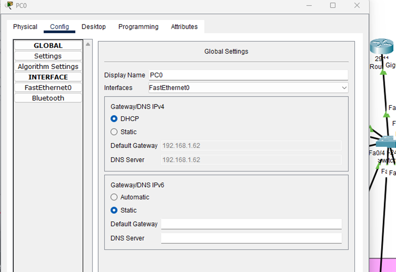

# SMALL OFFICE / HOME OFFICE (SOHO) IMPLEMENTATION

## Table of contents

-   [Story](#story)
-   [Technologies Implemented](#technologies-implemented)
    -   [Step 1](#step-1)
    -   [Step 2](#step-2)
    -   [Step 3](#step-3)
    -   [Step 4](#step-4)
    -   [Step 5](#step-5)
    -   [Step 6](#step-6)
    -   [Last step](#last-step)

---

# Story

XYZ company is a fast-growing company in Eastern Australia with more than 2 million customers globally. The company deals with selling and buying of food items, which are basically operated from the headquarters. The company is intending to open a branch near the local town. Thus, the company requires young IT graduates to design the network for the branch. The network is intended to operate separately from the HQ network. Being a small network, the company has the following requirements during implementation. Meaning that the Branch Network will be in a different autonomous system(AS) from the HQ network

-   One router and one switch to be used (all CISCO products).
-   3 departments (Admin/IT, Finance/HR and Customer service/Reception).
-   Each department is required to be in different VIANS.
-   Each department is required to have a wireless network for the users.
-   Host devices in the network are required to obtain IPv4 address automatically.
-   Devices in all the departments are required to communicate with each other.

Assume the ISP gave out a base network of 192.168.1.0, you as the young network engineer who has been hired, design and implement a network considering the above requirements.

# Technologies Implemented

1. Creating a Simple Network using a Router and Access Layer Switch.
2. Connecting Networking devices with Correct cabling.
3. Creating VLANs and assigning ports VLAN numbers.
4. Subnetting and IP Addressing.
5. Require Wireless Access Point to provide Wireless network
6. Configuring Inter-VLAN Routing (Router on a stick).
7. Configuring DHCP Server (Router as the DHCP Server).
8. Configuring WLAN or wireless network (Cisco Access Point).
9. Host Device Configurations.
10. Test and Verifying Network Communication.

## Step 1

**Adding prerequisite devices**

## Step 2

Given the base class C network 192.168.1.0 -> 3 Department -> 3 subnet

2^2 = 4 > 3

2 bit borrowed -> 255.255.255.192 = 11111111. 11111111. 11111111.11000000

| 1st subnet: /26                       | 2nd subnet: /26                         | 3rd subnet: /26                          |
| ------------------------------------- | :-------------------------------------- | :--------------------------------------- |
| Network IP: 192.168.1.0               | Network IP: 192.168.1.64                | Network IP: 192.168.1.128                |
| Usable IP: 192.168.1.1 - 192.168.1.62 | Usable IP: 192.168.1.65 - 192.168.1.126 | Usable IP: 192.168.1.129 - 192.168.1.190 |
| Broadcast IP: 192.168.1.63            | Broadcast IP: 192.168.1.127             | Broadcast IP: 192.168.1.191              |

## Step 3

**Configuring switchport to an Access Switchport**

## Step 4

**Configuring wireless for the users in the access point -> Configure each access point in each department**

## Step 5

Configure DHCP to automatically assign IP to end-host

> 1.  We configure the Switch that connected to the Router into a port trunk(To use Inter-VLAN Routing called Router on a Stick)
> <!-- TODO: PIC Step 5.1 -->
>
> 2.  Using dot1Q so when traffic from different can send data with a tagged frame
>
> 3.  I’m using the last usable IP address as the default gateway of each subinterface
>
>     

4.  After that we configure DHCP Server to share IP automatically to each end-host
5.  First we enable DHCP service in the Router
6.  After that we create DHCP pool for each department
       <table>
        <tr>
            <th>Admin/IT Department</th>
            <th>Finance</th>
            <th>Reception</th>
        </tr>
        <tr>
            <td>
                
            </td>
            <td>
                
            </td>
            <td>
                
            </td>
        </tr>
    </table>
7.  Changing the Internet into DHCP option on each device
    

## Step 6

Configuring Wireless network device

**Adding Phone and Laptop to each VLAN**

**After that we configure SSID to their respective VLAN and turn DHCP on each device so they will get assigned automatically**

**We first remove the old card and insert WPC300N to the laptop and turn the laptop back on**

**Same settings as the phone and turn on DHCP**

**Or we can use PC wireless option -> Replace the old card into WPC300 Wifi card in order to use this option**

# Last step

After this we will test the connectivity between each department

**The first packet always timed out because of the ARP protocol -> Every ping now is successfully works**
